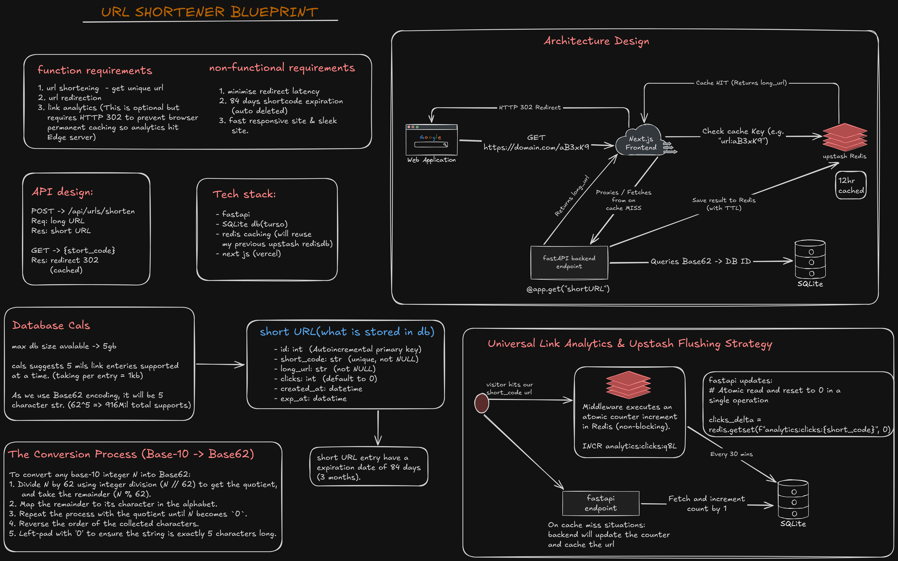

# ARCHITECTURE.md

## 1. App Flow & Architecture (Based on `shortyurl_v2` Blueprint)

The system decouples high-speed read redirections from database writes using a Fast Path, Slow Path, and Background Sync Path.



### The Fast Path (Edge Redirection / Cache Hit)
* **Routing**: Client -> Next.js Edge Middleware (`apps/web/middleware.ts`).
* **Cache Check**: Middleware queries Upstash Redis (`GET url:{short_code}`).
* **Cache HIT**: Middleware issues HTTP 302 Redirect directly to the long URL (~15ms response).
* **Analytics**: Middleware sends a non-blocking `INCR analytics:clicks:{short_code}` to Redis.

### The Slow Path (Cache Miss Fallback & URL Creation)
* **URL Creation (`POST /api/urls/shorten`)**:
  1. Client -> Next.js UI -> `POST /api/urls/shorten` -> FastAPI.
  2. FastAPI inserts row into Turso DB (`URLMapping` table) -> gets auto-increment `id`.
  3. Base62 encodes `id` -> 5-character `short_code`.
  4. Updates row with `short_code`.
  5. Caches in Redis: `SET url:{short_code} long_url EX 43200` (**12-Hour Cache TTL**).
  6. Returns `{ short_code, short_url }`.
* **Cache Miss Recovery (`GET /{short_code}`)**:
  1. Next.js Middleware proxies request to FastAPI.
  2. FastAPI decodes Base62 `short_code` -> integer `id`.
  3. Fast primary key lookup in Turso DB by `id`.
  4. **Lazy Enforcement**: Checks `expires_at > UTC_NOW` (84-day link lifespan). If expired -> HTTP 404.
  5. Re-populates Redis cache: `SET url:{short_code} long_url EX 43200` (12-Hour TTL).
  6. Increments analytics in Redis: `INCR analytics:clicks:{short_code}`.
  7. Returns HTTP 302 Redirect.

### The Background Path (Cron Jobs & Analytics Sync)
* **Analytics Sync (`POST /api/cron/flush-analytics`)**:
  - Vercel Cron triggers endpoint every 30 minutes.
  - Scans Redis keys matching `analytics:clicks:*`.
  - Executes atomic `GETSET analytics:clicks:{short_code} 0` to read accumulated clicks and reset the counter without race conditions.
  - Performs batch SQL `UPDATE url_mapping SET clicks = clicks + :val WHERE short_code = :short_code`.
* **Expiration Purge (`POST /api/cron/purge-expired`)**:
  - Vercel Cron triggers endpoint every 24 hours.
  - Executes bulk SQL `DELETE FROM url_mapping WHERE expires_at <= UTC_NOW`.
  - Evicts corresponding Redis keys.

---

## 2. Tech Stack & Requirements

* **Frontend / Edge**: Next.js 14+ (App Router), deployed on Vercel (`apps/web`).
* **Backend**: FastAPI, SQLModel, Pydantic, Python 3.12 (`apps/url-shortener-api`).
* **Database**: Turso (libSQL / SQLite) via `sqlalchemy-libsql==0.2.0` & `libsql-experimental==0.0.55`.
* **Cache & Analytics**: Upstash Redis (REST API via `upstash-redis`).

---

## 3. Monorepo Directory Structure

```text
/monorepo-root
├── /.agents
│   └── MEMORY.md                 # Persistent agent state & technical gotchas
│
├── /DOCS
│   ├── ARCHITECTURE.md           # System flow & architecture (blueprint reference)
│   ├── PHASES.md                 # Roadmap and phase breakdown
│   ├── PRD.md                    # Product requirements
│   └── RULES.md                  # Development rules & AI constraints
│
├── /apps
│   ├── /url-shortener-api        # FastAPI Backend Project
│   │   ├── .python-version       # Pinned to Python 3.12 (DO NOT REMOVE)
│   │   ├── pyproject.toml        # Dependencies and project config
│   │   ├── main.py               # App entry point, CORS, lifespan, /healthz
│   │   ├── /src/url_shortener_api
│   │   │   ├── /api/routes.py    # POST /api/urls/shorten, GET /{short_code}
│   │   │   ├── /core
│   │   │   │   ├── base62.py     # 5-character Base62 encode/decode logic
│   │   │   │   └── config.py     # Pydantic Settings
│   │   │   └── /db
│   │   │       ├── models.py     # SQLModel schema (URLMapping)
│   │   │       └── session.py    # Turso database connection engine
│   │   └── /tests
│   │       ├── test_base62.py    # 17 unit tests
│   │       └── test_routes.py    # 14 integration tests
│   │
│   └── /web                      # Next.js Frontend Project (Phase 2)
│       ├── /app                  # App Router pages and UI
│       └── middleware.ts         # Edge Middleware for Redis checking & 302 redirects
```